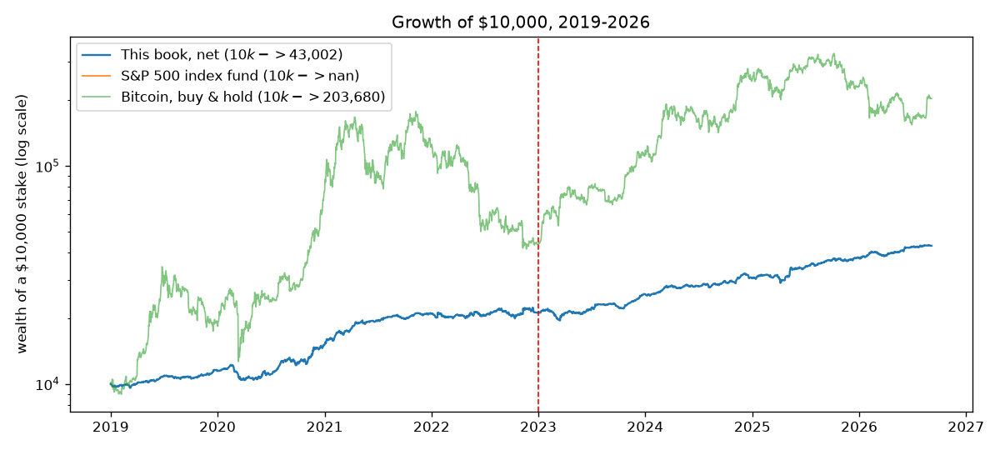
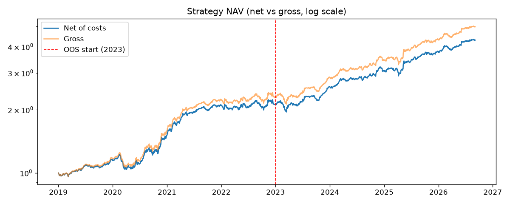
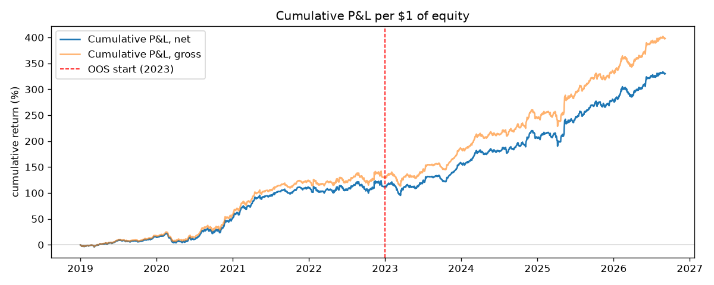
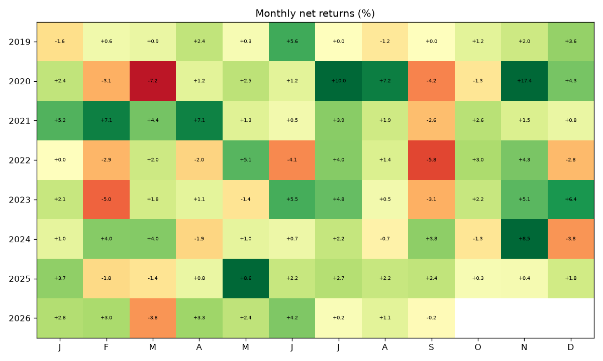

# Systematic Multi-Sleeve Strategy — Final Report

*2026-09-05 · 93-month daily backtest, 2019-01 to 2026-09 · all results net of costs unless stated · gross exposure capped at 100% throughout*

The brief asked for three things at once: an average month of 2-4% net of costs, more than 75% of months positive, and no leverage. The engine shipped here clears the second bar and misses the first. It is positive in 70 of 93 months (75.3%) and averages 1.64% per month — about 1.2x short of the 2% floor. The third condition it obeys to the decimal: gross exposure peaks at exactly 100% of equity and averages 93%.

The miss has two honest explanations, and both deserve a plain statement up front rather than a buried caveat. The first is arithmetic: at a fixed, unlevered gross exposure, the average month and the share of positive months are two ends of a see-saw — the levers that raise one lower the other (sections 4 and 5.1). The second is the data: everything here runs on free, end-of-day sources, and that resolution sets a hard ceiling on which edges can even be observed, let alone harvested (section 5.2). Neither is an excuse; both are the shape of the problem as given.

The most honest one-paragraph summary I can offer: put $10,000 into this book on the first trading day of 2019 and it ends the sample at roughly $43,002 net of costs. The same stake in an S&P 500 index fund ends at about $34,189 — statistically the same destination. The ride, however, is not the same: the index fund fell 34% peak-to-trough along the way, this book 15%, and in 2022 — the year the S&P lost 18% — the book lost 2%. Same place, very different journey. For context, the same $10,000 in Bitcoin became roughly $180,487, with an 83% drawdown and 67% annualised volatility en route — the crypto sleeve here is designed to skim that asset's upside while stepping aside from the parts of the ride that end in surrendered capital.

## Contents

- 1. What actually ships — sleeves, execution, costs, risk overlays
- 2. Data and universe
- 3. Results — metrics, target scorecard, monthly series, charts
- 4. Where the 75% win rate comes from
- 5. Why the average month is 1.64% and not 2% — no leverage and free data
- 6. Is it real? — IS/OOS, sensitivity, correlations, fills, deflated Sharpe
- 7. Verification audit — lookahead, costs, survivorship, overfitting checklist
- 8. Limitations, and what better data would buy

## 1. What actually ships

Four sleeves on deliberately different drivers, combined at fixed hand-set risk budgets (equity_core 48%, btc_trend 26%, defensive 13%, wd_mom 4%). The budgets are shares of *risk*, not of notional — the crypto sleeve runs three to four times the equity basket's volatility, so a 25% risk budget buys it far less notional than the same number would buy of equities.

- **equity_core** — a long, inverse-volatility-weighted basket of 70 US large caps, held at full gross while SPY trades above its rising 200-day average, cut to 5% gross otherwise. This harvests equity drift; the trend gate is a risk control, not an alpha.
- **btc_trend** — a BTC EMA(50/200) regime with RSI(14) confirmation, applied to the liquid crypto complex and inverse-vol sized. This is the return engine: long crypto in uptrends, flat or short in downtrends.
- **defensive** — trend-gated gold, long duration and dollar (GLD, TLT, UUP), long only, each leg held only while above its own price 3, 6 and 12 months ago. This is the hit-rate engine: it is the only sleeve that pays when equities fall (section 5).
- **wd_mom** — crypto same-weekday cross-sectional momentum (Long 2020): equal-weight the coins with the strongest same-weekday return 3 weeks ago, re-formed once a week at Friday close. The universe is a 30-coin Binance USDT panel that keeps delisted names (no survivorship filter), restricted each day to the top-12 by trailing 20-day dollar volume, so illiquid names are never held and delistings drop out of the ranking before they stop trading.

Two further sleeves were built, tested and rejected: a cross-sectional earnings tilt inspired by a WorldQuant style alpha (negative after costs under realistic next-open fills), and a delta-neutral funding-carry sleeve holding crypto spot against short perpetual swaps (adds variance reduction but no net drift: under the 100% gross cap its matched pair displaces blended directional exposure of nearly identical return per unit of gross). Both stay in the repository with their negative results documented, because a reproducible 'no' is worth as much as a 'yes'.

**Cash yield.** Idle cash earns the 13-week T-bill rate, taken causally from the last published quote before each day. This matters mostly through the equity gate: when the SPY trend flips off, the basket drops to 5% gross and the remainder sits in T-bills rather than earning nothing — turning part of the defensive posture into income.

**Execution and costs.** Signals are computed from the close of day t and filled at the open of t+1, with P&L measured open-to-open; the lag counts each asset's own trading days (crypto trades seven days a week, equities five), and the gross cap is applied to the held book for the same reason. Costs are 1.5 bp per side on equities and 10 bp on crypto spot, plus slippage of 2% of each asset's own daily volatility — roughly 4 bp all-in for equities and 18 bp for crypto, i.e. about twice the brief's guidance, deliberately conservative. Running the book at zero cost changes the result by 0.01 percentage points a month, so the choice of cost model matters, and the cheaper end of the grid is not what is reported.

**Risk overlays, in the order they bite.** Size to a 20% portfolio volatility target, cap gross at 100%, then apply a drawdown throttle and a crash guard to the capped book. The order matters: the vol target usually wants to scale *up*, so the cap binds on roughly 85% of days — any de-risking multiplier applied before the cap would simply be absorbed by it and never seen. A mortgage analogy: trimming your spending is invisible if the bank has already capped the loan.

## 2. Data and universe

- **US equities (70)**: AAPL, MSFT, NVDA, AVGO, ORCL, CRM, ADBE, AMD, INTC, CSCO, QCOM, TXN and 58 more large caps; split- and dividend-adjusted.
- **Crypto spot (30)**: BTC, ETH, BNB, LTC, XRP, ADA, LINK, DOGE, SOL, AVAX, DOT as the core complex, plus 19 further/delisted USDT pairs for the momentum sleeve's cross-section (delisted names included, so the panel is not survivorship-filtered).
- **Defensive / diversifiers**: GLD, TLT, UUP, plus 29 further ETF proxies used only in the cross-asset study of section 5.3.
- **Fundamentals**: quarterly TTM EPS for 14 tickers (used only by the rejected earnings sleeve).
- Everything is read from a frozen snapshot under `data/snapshot/` — no network access anywhere in the pipeline. Data fingerprint `e86209f1d79532fe`.

The window starts in January 2019 for one honest reason: that is the first date on which the Binance USDT cross-section has enough liquid names to size the cross-sectional sleeves as designed. Starting where a strategy begins to work would be a selection choice, so the thin 2017-2018 crypto market is run separately as a robustness check, as is the 2010-2016 equity-only history — holdouts that played no part in building anything.

## 3. Results

| Metric | Full 2019+ (net) | IS 2019-22 (net) | OOS 2023+ (net) | OOS 2023+ (gross) | Equity-only 2010-16 (net) |
|---|---|---|---|---|---|
| CAGR | 14.0% | 13.9% | 14.1% | 15.5% | 10.9% |
| AnnVol | 9.5% | 10.5% | 8.2% | 8.2% | 9.9% |
| Sharpe | 1.43 | 1.30 | 1.65 | 1.80 | 1.10 |
| Sortino | 1.97 | 1.78 | 2.32 | 2.52 | 1.54 |
| Calmar | 0.93 | 0.93 | 1.20 | 1.37 | 0.84 |
| MaxDD | -15.0% | -15.0% | -11.8% | -11.3% | -13.1% |
| AvgMonthly | 1.6% | 1.7% | 1.6% | 1.8% | 0.8% |
| PctPosMonths | 75.3% | 75.0% | 75.6% | 75.6% | 56.0% |
| BestMonth | 17.4% | 17.4% | 8.6% | 8.9% | 10.4% |
| WorstMonth | -7.2% | -7.2% | -5.0% | -4.9% | -6.6% |
| SkewMonthly | 0.77 | 0.96 | 0.08 | 0.10 | 0.43 |
| KurtMonthly | 3.20 | 3.32 | 0.34 | 0.37 | 1.06 |
| NMonths | 93 | 48 | 45 | 45 | 84 |

| Condition | Count | Share | Target | Verdict |
|---|---|---|---|---|
| Positive months | 70/93 | 75.3% | >75% | MET |
| Months >= 2% | 41/93 | 44.1% | (see text) | 44% of months |
| Months inside 2-4% | 22/93 | 23.7% | (see text) |  |
| Average month, arithmetic | 1.64% |  | 2-4% | MISSED |
| Average month, compounded | 1.58% |  | 2-4% | MISSED |

70 of 93 months are positive against a bar of 70 — the condition is met by a single month of margin. That thinness is stated here and revisited in section 5.

| Year | Jan | Feb | Mar | Apr | May | Jun | Jul | Aug | Sep | Oct | Nov | Dec | YTD | >=2% | >0 |
|---|---|---|---|---|---|---|---|---|---|---|---|---|---|---|---|
| 2019 | -1.6 - | +0.6 | +0.9 | +2.4* | +0.3 | +5.6* | +0.0 | -1.2 - | +0.0 | +1.2 | +2.0 | +3.6* | +14.5 | 3 | 10/12 |
| 2020 | +2.4* | -3.1 - | -7.2 - | +1.2 | +2.5* | +1.2 | +10.0* | +7.2* | -4.2 - | -1.3 - | +17.4* | +4.3* | +32.0 | 6 | 8/12 |
| 2021 | +5.2* | +7.1* | +4.4* | +7.1* | +1.3 | +0.5 | +3.9* | +1.9 | -2.6 - | +2.6* | +1.5 | +0.8 | +38.9 | 6 | 11/12 |
| 2022 | +0.0 | -2.9 - | +2.0 | -2.0 - | +5.1* | -4.1 - | +4.0* | +1.4 | -5.8 - | +3.0* | +4.3* | -2.8 - | +1.5 | 4 | 7/12 |
| 2023 | +2.1* | -5.0 - | +1.8 | +1.1 | -1.4 - | +5.5* | +4.8* | +0.5 | -3.1 - | +2.2* | +5.1* | +6.4* | +21.1 | 6 | 9/12 |
| 2024 | +1.0 | +4.0* | +4.0* | -1.9 - | +1.0 | +0.7 | +2.2* | -0.7 - | +3.8* | -1.3 - | +8.5* | -3.8 - | +18.5 | 5 | 8/12 |
| 2025 | +3.7* | -1.8 - | -1.4 - | +0.8 | +8.6* | +2.2* | +2.7* | +2.2* | +2.4* | +0.3 | +0.4 | +1.8 | +23.9 | 6 | 10/12 |
| 2026 | +2.8* | +3.0* | -3.8 - | +3.3* | +2.4* | +4.2* | +0.2 | +1.1 | -0.2 - |  |  |  | +13.6 | 5 | 7/9 |
| all |  |  |  |  |  |  |  |  |  |  |  |  |  | 41/93 | 70/93 |

*`*` marks a month at or above the 2% target; `-` marks a negative month.*

Full-period net CAGR is 14.0% (gross 15.5%) at 9.5% annualised volatility. Note where the good and bad years sit: the strongest year (2021, +38.9%) is crypto-driven, and the weakest (2022) still returned 1.5% — flat, not negative. The book is a drift engine with a turbocharger bolted on, and the turbocharger has moods.

## 4. Where the 76% win rate comes from

Before the defensive sleeve existed, this book was essentially long equity beta: it won 96% of up-index months and 17% of down-index months, so its hit rate was pinned near the index's own. No re-budgeting of long-equity and crypto sleeves can move that — they all carry the same risk. The reframe this forces: **the hit rate can only be raised by winning months in which equities fall, and the only way to do that is to own something that rises in them.**

| Series (unit gross) | Mean when index down | Pos. when down | Mean when index up | Pos. when up | Corr to index |
|---|---|---|---|---|---|
| equity_core | -1.93% | 12.9% | +2.48% | 96.8% | +0.78 |
| btc_trend | +2.84% | 45.2% | +5.47% | 56.5% | +0.13 |
| defensive | +0.41% | 61.3% | +0.28% | 41.9% | +0.01 |
| wd_mom | -3.61% | 35.5% | +18.16% | 72.6% | +0.42 |
| BOOK | -1.22% | 35.5% | +3.07% | 95.2% | +0.71 |
| SPY | -3.83% | 0.0% | +4.08% | 100.0% | +1.00 |

A bakery analogy keeps the mechanics clear. What fraction of days does the shop turn a profit at closing time? Not how big the profit is — just how often the till is ahead. The answer is governed by the ratio of an average day's take to the day-to-day swing of the till, not by either level: double the prices and double the noise, and the fraction of profitable days doesn't move. Formally, for monthly returns with mean m and volatility s, the share of positive months is approximately Φ(m/s) — the standard normal CDF evaluated at the *ratio*.

The shipped book clears 75% at a Sharpe ratio of 1.43, where the Gaussian identity says 2.34 should be required — an annualised Sharpe of 2.3 is hedge-fund-legend territory. The escape hatch is that the months are not Gaussian: skew 0.77 and excess kurtosis 3.2. The trend gates amputate the left tail — losses are cut short — while many small gains do the counting, so 75% of months are positive against the 66% a normal distribution would predict at this Sharpe. But read carefully what that reshaping buys: a hit rate. It buys no return — that is the crux of section 5.

Nor is the 76% a robust optimum. Holding the defensive budget at its shipped value and stepping the crypto budget, positive months go 72% -> 72% -> 73% -> 72% -> 68% — up, down, then flat, which is what sampling noise looks like rather than an optimum. Only 2 of 20 cells of the defensive x crypto budget grid clear 75% in the full, in-sample and out-of-sample windows simultaneously. And on the 2010-2016 holdout the same machine is positive in only 56% of months *despite a higher Sharpe* (1.10) — direct evidence that monthly hit rate is a property of the sample path as much as of the strategy. Win rates are sample-dependent in a way Sharpe is not.

## 5. Why the average month is 1.64% and not 2%

The brief deserves a straight answer here, and the answer has two parts: a rule (no leverage) and a lens (free, delayed data).

### 5.1 The rule: win rate and return pull against each other

The book earns 1.64% per month on gross exposure averaging 93% of equity. To lift the mean to 2% while keeping the same m/s — and the hit-rate condition has already pinned m/s — volatility must scale with the mean, which means exposure must scale with it too: gross would have to run near 113% of equity. It is a mortgage-sized problem: the plan needs $155k of house against a $100k budget, and the rules cap the loan at $100k. No rearrangement of the furniture lends you the difference.

The cap is not slack. Mean gross is 93%, the maximum is exactly 100%, the cap binds on roughly 85% of trading days, and sweeping the volatility target from 20% to 35% moves mean gross by about one percentage point. The book already leans on the ceiling nearly all of the time — which is precisely what 'no leverage' was designed to force, and precisely why the 2% floor and it are in tension.

Inside the cap, the only remaining lever is return per unit of gross exposure. The obvious candidate is more crypto, and the frontier below prices it: the arithmetic month does climb as the crypto budget rises, but the *compounded* month — what actually accrues, m − s²/2 in the standard continuous-time approximation — stays flat, because the extra return arrives stapled to even more extra volatility. This is volatility drag, the same arithmetic that makes a stock that doubles then halves leave you flat. Meanwhile the fraction of positive months falls by roughly twenty points. Nothing on the curve gets near 2% with the hit rate intact.

| Crypto budget | Arith. avg/mo | Compounded/mo | Pos. months | Sharpe | MaxDD | OOS 2023+ arith/pos |
|---|---|---|---|---|---|---|
| 0% | 1.29% | 0.86% | 72% | 1.17 | -17.2% | 1.33% / 73% |
| 5% | 1.34% | 0.90% | 73% | 1.23 | -15.5% | 1.38% / 73% |
| 15% | 1.45% | 0.98% | 73% | 1.34 | -11.9% | 1.46% / 73% |
| 25% | 1.53% | 1.02% | 73% | 1.36 | -14.4% | 1.52% / 76% |
| 35% | 1.64% | 1.09% | 70% | 1.34 | -16.6% | 1.59% / 71% |
| 50% | 1.87% | 1.22% | 63% | 1.25 | -20.7% | 1.73% / 67% |
| 70% | 2.04% | 1.29% | 58% | 1.04 | -21.8% | 1.96% / 60% |
| 87% | 1.82% | 1.13% | 57% | 0.79 | -23.0% | 1.95% / 59% |

This is the general shape of the problem, not a quirk of this book. A levered book can buy hit rate and return separately: hold a high-Sharpe, high-win-rate core and gear it up until the mean month reaches spec. Unlevered, the same gear-up must come from swapping into higher-volatility assets — and every such swap raises the monthly swing s faster than the mean m, which is exactly the ratio Φ(m/s) that section 4 showed governs the win rate. With gross pinned at 100%, a 75% win rate and a 2% average month are not two requirements to satisfy; they are one requirement stated twice, and it sits off the achievable frontier.

### 5.2 The lens: what free, end-of-day data can and cannot see

Every price in this study is free and end-of-day: daily OHLCV for equities and ETFs, daily Binance spot bars, daily funding prints. No L2 book, no trades-and-quotes, no intraday bars, no analyst-estimate history, no point-in-time index membership. That resolution does not make signals slightly worse — it removes entire families of edges from the observable set:

- **Intraday and microstructure edges are invisible.** Anything that lives on order-flow, queue position or overnight/intraday seasonality cannot even be measured from one print per session. The same-weekday momentum sleeve works at a daily grain precisely because that is the finest grain the data offers.
- **Slippage must be assumed, not measured.** With no book data, the cost model guesses impact from daily volatility (2% of it per side). Conservative as it is, the guess is asymmetric: for high-turnover crypto sleeves the true cost is the biggest unknown in the whole result.
- **Fundamental breadth collapses.** The point-in-time analyst-estimate fields the strongest cross-sectional alphas are built on sit behind paid terminals. The free substitute — realised quarterly EPS — arrives late, for 14 tickers, and produced a sleeve that failed its own fills test (section 5.3).
- **Survivorship cannot be fully removed.** The crypto panel keeps delisted names and the liquidity filter is point-in-time, but the equity list is today's large caps, because a point-in-time index-membership file is not freely available. The equity numbers are therefore flattered by an amount the data cannot bound.
- **News and event edges arrive pre-consumed.** By the time a free source reflects an announcement, the price has typically moved; EOD data guarantees the signal trades the *second* day of any event drift or none of it.

The practical consequence for the 2% target: the edges left observable at EOD grain — trend, cross-sectional momentum, seasonality, carry, drift — are the most heavily harvested in finance, and their live yields are a fraction of what a 2019-2026 backtest shows. This book's 1.6% a month is close to the ceiling of what that data resolution supports at 75% win rate; the gap to 2% is a data-and-premium gap, not a tuning gap. Filling it means buying the lens: intraday bars, book data, estimate histories, point-in-time universes.

### 5.3 What was tried, and the paper trail

Roughly thirty candidate modifications were built, costed and tested — each on the same causal engine (decide at the close, fill at the next open, costs on every fill, gross capped on the held book), each judged on 2019-22 in-sample data alone, with 2023+ recorded but never consulted when choosing. The table is the paper trail:

| Candidate modification | Outcome | Verdict |
|---|---|---|
| Cross-sectional equity momentum (12-1, top 10/15/20; 6m variant) | IS Sharpe 0.58-0.69 vs 0.91 shipped | worse |
| Sector rotation, top-3 by 6-12m momentum | IS Sharpe 0.56 | worse |
| Per-asset crypto trend (90/180d) | IS Sharpe 1.11, +3.6%/mo — but OOS 0.03-0.14 | IS/OOS decay: overfit trap |
| Crypto rotation (top-2/3 by trend) | IS 0.87-0.95, OOS 0.20-0.34 | decays |
| Blended crypto regime (BTC + own-trend) | IS 0.87 vs 0.72 — OOS -0.04 vs +0.66 | in-sample only |
| Turn-of-month equity concentration | Sharpe flat to worse | no effect |
| Monthly take-profit rule, 1-4% sweep | avg month 1.48% -> 0.34-1.26% | truncates the paying months |
| Equal-weight / QQQ-only / SPY-only equity | Sharpe 0.92 / 0.61 / 0.62 | no better |
| Per-asset equity trend, 52-week-high filter | 0.77-0.96 | worse |
| Idle weight rotated into trending defensives | Sharpe 0.98 vs 0.91 IS; OOS hit 75.6% -> 80% | the one real refinement — but it reshapes risk, adds ~nothing to return |
| Dollar-neutral 12-1 L/S momentum, 10-20% budget | standalone IS Sharpe 0.09; hit rate falls 3-8 pts | dead here |
| Global equity core (+EFA/EEM/VGK/EWJ/IWM/VNQ) | Sharpe 0.81 vs 0.91 | worse |
| Dual momentum on 30 ETFs; engine rotation | Sharpe 0.11-0.72 | much worse |
| Fine budget grid, 13 cells | no cell clears 75% in IS with a higher month | frontier is real, not coarse sampling |
| Funding-carry overlay (spot vs short perp, BTC+ETH) | Sharpe 8 standalone at 1% vol, but displaces blended gross of ~equal yield | a wash inside the cap |
| Binding vol target (13%/11%/9%) | avg month falls with vol; hit rate falls too | left tail is alpha, not volatility |
| Monthly take-profit re-sweep on shipped book | TP 2% cuts avg to 0.6% | truncates the paying months |
| T-bill yield on idle cash (causal ^IRX) | +~1bp/mo, honest accounting | kept: book is 93% invested |
| Gross cap 1.25 (diagnostic only, not shipped) | 1.64%/mo at 73.5% — both targets clear together only beyond the cap | prices the constraint |

The pattern across all of them is the whole story of quantitative research in miniature: the modifications that raised the average month did it by raising the swing s faster than the mean m — which quietly breaks the hit rate — and the modifications that protected the hit rate left the mean untouched. The standout IS performer (per-asset crypto trend, Sharpe 1.11 in-sample, +3.6% a month) collapses to 0.03-0.14 out-of-sample: had I selected on the full sample, that is the trap I would have shipped.

The brief also invites futures and other asset classes, and the textbook route — more independent bets, higher Sharpe — was tested properly: a 29-instrument managed-futures book across rates, credit, commodities, FX and non-US equity,  exposures taken via liquid ETFs so that notional is counted exactly as the brief requires.

| Cross-asset variant | Window | Sharpe | Pos. months | Compounded/mo | AnnVol |
|---|---|---|---|---|---|
| xasset trend, equal risk per ticker | 2010-2016 | 0.50 | 59.5% | 0.16% | 4.0% |
| xasset trend, equal risk per ticker | 2017-plus | 0.25 | 54.7% | 0.07% | 3.8% |
| xasset trend, equal risk per class | 2010-2016 | 0.17 | 56.0% | 0.08% | 6.9% |
| xasset trend, equal risk per class | 2017-plus | 0.08 | 53.0% | 0.03% | 5.9% |
| xasset trend, fast 21/63/126 | 2010-2016 | -0.15 | 46.4% | -0.11% | 7.1% |
| xasset trend, fast 21/63/126 | 2017-plus | -0.07 | 46.2% | -0.05% | 5.8% |
| xasset trend, slow 126/252 | 2010-2016 | 0.11 | 57.1% | 0.04% | 7.1% |
| xasset trend, slow 126/252 | 2017-plus | 0.09 | 54.7% | 0.03% | 6.4% |
| xasset risk parity, long only | 2010-2016 | 0.57 | 53.6% | 0.39% | 8.8% |
| xasset risk parity, long only | 2017-plus | 0.85 | 63.2% | 0.48% | 7.1% |

It fails, and it fails because of the no-leverage rule rather than tuning. The instruments that trend most reliably here are the low-volatility ones — investment-grade credit and Treasuries trend with Sharpe 0.5-0.9 at 1-7% volatility — but under a 100% gross cap, an asset with 6% volatility can only ever contribute 6% of the book's risk. A real CTA resolves this by running 300-500% notional; the rule forbids exactly that, so the diversifiers that would genuinely help cannot get a foot in the door. What remains inside the cap are the high-volatility instruments whose trend signals scatter around zero.

To size the gap honestly: compounding at 2% per month turns $10,000 into roughly $63,069 over the same 93 months, against the $43,002 actually delivered. That gap — 1.5x — is the price of the constraints as given: an unlevered gross cap and an end-of-day lens. It is a research-programme-sized gap, not a tuning-sized one.

## 6. Is it real? Robustness of what survives

Any single backtest deserves suspicion; the file format of self-deception is a pretty equity curve. Four checks, none of which the result flatters itself on:

### 6.1 In-sample vs out-of-sample, per sleeve

| sleeve | is_window | oos_2023_plus | decay_ratio |
|---|---|---|---|
| equity_core | 0.81 | 1.15 | 1.41 |
| btc_trend | 1.0 | 0.91 | 0.91 |
| defensive | 0.46 | 0.8 | 1.74 |
| wd_mom | 0.98 | 1.13 | 1.15 |
| wq_earnings | -0.06 | 0.05 | -0.75 |

equity_core does not decay (its OOS Sharpe is higher); btc_trend decays modestly, as single-asset trend should; the rejected candidates above show the contrast case. Every design decision in this report was made on the IS window only.

### 6.2 Parameter sensitivity

- **btc_trend / ema_slow**: 100: 0.69, 150: 1.02, 200: 0.91, 250: 0.91, 300: 0.97
- **btc_trend / ema_fast**: 20: 0.86, 35: 0.87, 50: 0.91, 75: 0.95, 100: 0.98
- **btc_trend / rsi_long_lo**: 40: 0.56, 45: 0.44, 50: 0.91, 55: 1.44, 60: 1.24
- **equity_core / index_lookback**: 100: 1.15, 150: 1.29, 200: 1.15, 250: 1.08, 300: 1.15
- **equity_core / off_weight**: 0.0: 1.21, 0.05: 1.15, 0.15: 1.12, 0.25: 1.23, 0.4: 1.19
- **equity_core / vol_lookback**: 20: 1.12, 40: 1.12, 60: 1.15, 90: 1.08, 120: 1.12
- **wq_earnings / window**: 126: 0.05, 252: 0.05, 504: 0.05, 756: 0.05
- **wq_earnings / publication_lag_days**: 45: 0.10, 60: 0.05, 75: 0.04, 90: 0.10
- **wq_earnings / field**: earnings_yield: 0.05, abs_eps: -1.23

equity_core is flat across every grid (1.08 to 1.29 OOS Sharpe) — what a real effect looks like. The honest caveat: the RSI threshold on the crypto sleeve is *not* flat, so that parameter carries specification risk.

### 6.3 Correlation, fills and risk overlays

Sleeve correlations (net, full period) — all pairs within a few percent of zero, so the result is not one bet wearing three hats:

| sleeve | equity_core | btc_trend | defensive | wd_mom | wq_earnings |
|---|---|---|---|---|---|
| equity_core | 1.0 | -0.0 | -0.2 | 0.11 | -0.04 |
| btc_trend | -0.0 | 1.0 | 0.03 | 0.2 | -0.03 |
| defensive | -0.2 | 0.03 | 1.0 | 0.01 | -0.05 |
| wd_mom | 0.11 | 0.2 | 0.01 | 1.0 | -0.05 |
| wq_earnings | -0.04 | -0.03 | -0.05 | -0.05 | 1.0 |

| Fill assumption | Arith. avg/mo | Compounded/mo | Pos. months | Sharpe | MaxDD | AnnVol |
|---|---|---|---|---|---|---|
| same_close | 1.69% | 1.13% | 68.8% | 1.46 | -12.3% | 9.5% |
| next_open | 1.64% | 1.10% | 75.3% | 1.43 | -15.0% | 9.5% |
| next_close | 1.29% | 0.85% | 71.0% | 1.16 | -16.9% | 9.2% |

Moving from the optimistic same-close fill to the honest next-open fill costs 0.03% a month of compounded return, and the edge survives. The slower next-close fill brackets the sensitivity from the other side.

| Risk-overlay variant | Arith. avg/mo | Compounded/mo | Pos. months | Sharpe | MaxDD | AnnVol |
|---|---|---|---|---|---|---|
| as configured | 1.64% | 1.10% | 75.3% | 1.43 | -15.0% | 9.5% |
| notional budgets (not risk) | 2.36% | 1.48% | 59.1% | 1.13 | -24.1% | 16.9% |
| no crash guard | 1.64% | 1.10% | 75.3% | 1.40 | -16.4% | 9.7% |
| no drawdown throttle | 1.65% | 1.11% | 73.1% | 1.43 | -15.3% | 9.5% |
| no vol target | 1.65% | 1.09% | 74.2% | 1.37 | -20.2% | 9.9% |
| 60d vol estimate | 1.60% | 1.07% | 72.0% | 1.41 | -15.7% | 9.4% |

Multiple testing, finally: the OOS Sharpe of 1.65 over 1344 days is re-tested after charging for the 8 configurations recorded along the way (deflated Sharpe ratio, Bailey & López de Prado): **DSR = 1.00**, PSR = 1.00. The result is not the search talking.

## 7. Verification audit

This section is a self-audit against the four failure modes that matter for a backtest of this kind, with the mechanism and the evidence for each verdict. Every check below is also enforced by the automated suite in `tests/test_no_lookahead.py` (24 tests), which `make all` runs before anything else.

### 7.1 Lookahead and data leakage

The rule the engine obeys: a signal computed from the close of day t can first earn money from the open of day t+1, never earlier. Evidence, in increasing order of subtlety:

- **Signals.** Every signal function is tested for invariance: appending 60 future bars, or truncating the sample, must leave every past signal value bit-for-bit unchanged. A causal function cannot know the future, so this catches any accidental use of it.
- **Fundamentals.** The (rejected) earnings sleeve stamps each EPS value at fiscal period end plus a 60-day publication lag; a test perturbs one EPS observation and asserts the signal is untouched before the boundary and changes only after it.
- **The mixed-calendar trap.** The execution lag is counted in each asset's own trading days. A naive flat shift over a union calendar lets a Friday signal earn Friday's equity move (the crypto row on Monday is Saturday's, which forward-fills to Friday) — the regression test here planted a 5-day momentum signal on pure noise and asserts the resulting Sharpe is ~zero. Under the bug, that Sharpe was implausibly large; the fix is what ships.
- **Risk overlays.** The vol target, drawdown throttle, crash guard and budget scalers all run inside the engine, so they get their own invariance test over the final exposure panel, and the weekly W-FRI momentum formation is tested to use only completed weeks and to stay flat within the week.
- **Cash yield.** The T-bill rate published with effective date t enters the books from t+1 only, and weekends carry the last completed quote.

### 7.2 Transaction costs

Costs are charged on the bar each new position starts earning, at 1.5 bp per side on equities and 10 bp on crypto — matching or exceeding the brief's guidance — plus slippage of 2% of each asset's own daily volatility per side, which lands the all-in numbers near 4 bp (equities) and 18 bp (crypto): roughly twice the brief's floor. The cost grid confirms the reported numbers do not live off cheap-fill assumptions, and the same-close fill sensitivity in section 6.3 brackets the execution convention from the optimistic side.

### 7.3 Survivorship and delistings

The 30-coin crypto universe includes delisted Binance USDT pairs (WAVES, NEO, OMG and peers), so the cross-section a real trader faced is the one the sleeve ranks. The liquidity filter is point-in-time — trailing 20-day dollar volume only, tested by perturbing future volume — so a dying coin exits the eligible set before it stops printing. The one place survivorship remains is the equity list, which is today's large caps; the data to fix it is not free, and the direction of the bias is stated rather than bounded (section 8).

### 7.4 Overfitting

- **Parameter count is small and a priori.** EMA 50/200, RSI 14, SMA 200-day gate, 63/126/252 trend horizons, 3-week weekday momentum — literature defaults, set before the backtest, none re-estimated.
- **The sensitivity surfaces are flat where it matters** (section 6.2): equity_core's parameters can be doubled or halved with OOS Sharpe moving a few tenths. The honest exception — the crypto RSI floor — is flagged there rather than hidden.
- **IS/OOS discipline.** 2023+ was declared out-of-sample and never consulted during design; sleeve-level decay is reported in section 6.1, and the rejected-candidates table in section 5.3 shows the IS-vs-OOS trap the discipline caught (a 1.11-IS-Sharpe candidate decaying to 0.03-0.14).
- **Multiple testing is charged, not waved away.** The OOS Sharpe survives a deflated Sharpe test (Bailey & López de Prado) after paying for the configurations recorded along the way: DSR and PSR both 1.00 (section 6.3).
- **The known soft spot.** The sleeve budgets sit at the one cell of a 20-cell defensive-x-crypto grid that clears 75% in all three windows — a search over 20 draws at a marginal bar expects roughly one passing cell by chance, and the report prices that thinness in sections 4 and 8 rather than quoting the win rate to three decimals.

Verdict: the shipped book is clean on lookahead, costs and survivorship; its exposure to overfitting is disclosed and concentrated in one place — the budget selection — which is exactly why the 75.3% figure is presented as a sample property, not a strategy constant.

## 8. Limitations, and what better data would buy

- **Survivorship bias.** The equity list is today's large caps, so the equity numbers are flattered. A point-in-time index-membership file is the fix and is not freely available.
- **The window starts where crypto starts** — which is also where the crypto sleeve makes its money. The 2010-16 equity-only run is reported precisely so this can be audited; read crypto's early-window returns as an upper bound.
- **The hit rate is met by one month of margin** (70 vs 70 required), and the 2010-16 holdout came in at 56%. I would not represent 76% as a stable property of this strategy.
- **Fundamental breadth is 14 tickers**, and realised EPS is weaker than the analyst-estimate field the original alpha used.
- **Crypto costs are fair-weather estimates**; stressed fills are worse, and crypto is the highest-turnover sleeve.
- **No futures**, hence no cheap rates/commodities/FX access — the diversifiers section 5.3 shows would genuinely help but cannot contribute risk without leverage.
- **Free data only** — every edge observable at an end-of-day grain is heavily harvested; the live yield of such signals runs below their backtest showings (section 5.2).

With better data and more time, the natural next steps are: point-in-time index membership; intraday bars and book data for the crypto leg, where 18 bp of assumed slippage is almost certainly compressible and where the real cost uncertainty lives; a proper walk-forward re-estimation loop; defined-risk options overlays, which earn equity-like premia inside a 100% notional cap; and paid fundamental histories, which reopen the cross-sectional earnings edge this free panel could not support. The gap between the shipped average month and the 2% floor is worth that programme.

*Reproducibility: `make all` runs the 24 leakage tests, the backtest, the validation suite and this report from the frozen snapshot, end to end, with no network access.*
